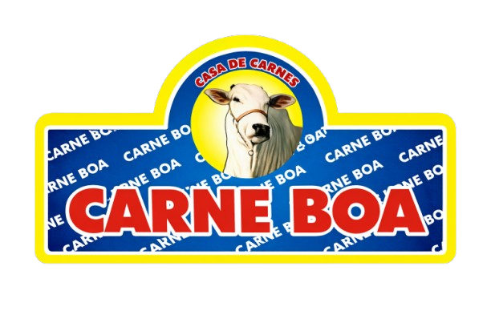

# 

<div align="center">
  
  
  
</div>

<br>

<div align="center">
  <table>
    <tr>
      <td width="25%" bgcolor="#A52322"></td>
      <td width="25%" bgcolor="#D6A646"></td>
      <td width="25%" bgcolor="#295B47"></td>
      <td width="25%" bgcolor="#F4EFE7"></td>
    </tr>
  </table>
</div>

## Sobre

Landing page responsiva do **Frigorifico Carne Boa**, focada em atendimento mobile, montagem de pedido por quilo e envio direto do orcamento para a unidade escolhida via WhatsApp.

## Destaques

- Hero com identidade visual forte e foco em conversao.
- Contato rapido para **Loja 01**, **Loja 02** e Instagram.
- Secao de localizacao com mapa incorporado.
- Carrinho simples em JavaScript puro.
- Envio do pedido formatado para o WhatsApp, sem exibir precos no site.
- Layout pensado para telas pequenas e navegacao direta.

## Paleta do projeto

<div>
  <span style="display:inline-block;padding:8px 12px;margin:4px;border-radius:999px;background:#A52322;color:#FFFAF4;font-weight:700;">#A52322 Brand</span>
  <span style="display:inline-block;padding:8px 12px;margin:4px;border-radius:999px;background:#6E1618;color:#FFFAF4;font-weight:700;">#6E1618 Brand Dark</span>
  <span style="display:inline-block;padding:8px 12px;margin:4px;border-radius:999px;background:#D6A646;color:#1F2430;font-weight:700;">#D6A646 Accent</span>
  <span style="display:inline-block;padding:8px 12px;margin:4px;border-radius:999px;background:#295B47;color:#FFFAF4;font-weight:700;">#295B47 Forest</span>
  <span style="display:inline-block;padding:8px 12px;margin:4px;border-radius:999px;background:#F4EFE7;color:#1F2430;font-weight:700;border:1px solid #d8d1c8;">#F4EFE7 Background</span>
</div>

## Estrutura

```text
.
|-- index.html
|-- script.css
|-- script.js
`-- assets/
```

## Como executar

Como o projeto e estatico, basta abrir o `index.html` no navegador.

Se preferir rodar com servidor local:

```powershell
python -m http.server 8000
```

Depois acesse `http://localhost:8000`.

## Fluxo do site

1. O cliente escolhe a unidade.
2. Adiciona os cortes e os quilos ao carrinho.
3. Informa nome, endereco e observacoes.
4. O site monta a mensagem automaticamente.
5. O pedido e enviado para o WhatsApp da loja selecionada.

## Regras de negocio atuais

- O site **nao exibe precos**.
- O orcamento e tratado apenas pelos canais oficiais no WhatsApp.
- O carrinho agrupa cortes repetidos somando o peso.
- O peso minimo por item e `0.5 kg`.

## Contato exibido no projeto

- **Loja 01:** `(91) 98163-6475`
- **Loja 02:** `(91) 98864-8944`
- **Instagram:** `@frigorificocarneboa_`
- **Endereco:** `Av. Rodolfo Chermont 1146, Belem, Brazil`

## Melhorias futuras

- Persistencia do carrinho no navegador.
- Painel de administracao para cortes e estoque.
- Integracao com catalogo dinamico.
- Ajuste de SEO local e dados estruturados.

<div align="center">
  <sub>Frigorifico Carne Boa - presenca digital com foco em atendimento rapido, visual forte e conversao via WhatsApp.</sub>
</div>
